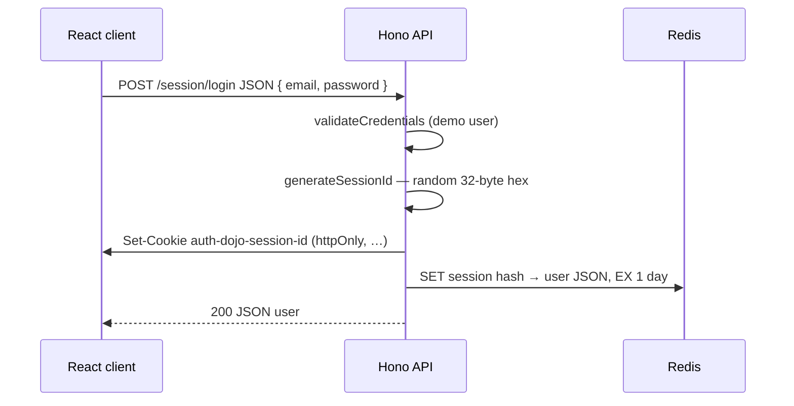
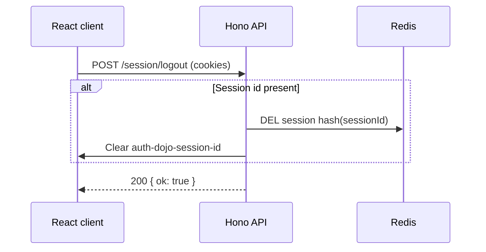

# Session authentication (opaque cookie + Redis)

This project demonstrates **classic server-side session auth**: the browser holds only an **opaque session identifier** in an **HTTP-only cookie**. The server maps that id to the signed-in user in **Redis**. There is **no JWT** and **no separate access vs. refresh** layer — identity for each request is resolved by looking up the session row.

---

## High-level overview

**What you are proving in code**

- After a successful login, the API generates a **random session id** (not meaningful to the client), stores **`LoginUser`** in Redis under a **deterministic hash** of that id, and sets **`auth-dojo-session-id`** as an **`httpOnly`** cookie (`sameSite: 'strict'`, **`secure: true`** — see `cookieOptions` in `credentials.ts`).
- Each protected request reads the cookie, hashes the id, loads the user from Redis, and attaches **`user`** to the context for the handler.
- **Logout** deletes the Redis row for that session and clears the cookie. Unlike the token flow, there is **no access-token blacklist**: once the session row is gone, the cookie is useless.

**How the pieces are split in this repo**

| Concern                         | Where it lives                                                                                                                                 |
| ------------------------------- | ---------------------------------------------------------------------------------------------------------------------------------------------- |
| Login credential check          | `auth-api/src/routers/shared/middleware.ts` — `validateCredentials` (demo fixed email/password from `secretLogin` in `credentials.ts`)       |
| Demo login user / cookie defaults | `auth-api/src/routers/shared/credentials.ts` — `LoginUser`, `cookieOptions`, `loginSchema`                                                     |
| Session id generation & cookie  | `auth-api/src/routers/session-router/sessions.ts` — `auth-dojo-session-id`, `randomBytes(32)` hex id                                           |
| Session → user store (Redis)    | `auth-api/src/routers/session-router/store.ts` — keys prefixed **`session:`**, hashing via `hashValue` from `shared/utils.ts`                  |
| HTTP routes for `/session/*`    | `auth-api/src/routers/session-router/index.ts`                                                                                                  |
| `validateSession` middleware    | `auth-api/src/routers/session-router/middleware.ts`                                                                                             |
| CORS for credentialed browser calls | `auth-api/src/index.ts` — `credentials: true`, origin from `FRONTEND_URL`; router mounted at **`/session`**                                     |

**Redis usage**

- **Sessions:** key **`session:<hashValue(sessionId)>`**, value **`JSON.stringify(LoginUser)`**, TTL **1 day** (`durationSeconds(1, 'days')`). The raw session id exists only in the cookie; Redis uses a **hashed key** (same helper as the token router: **`hashValue`** wraps **`Bun.hash`**).
- **`GET /health`:** **`PING`s** Redis via the same shared **`RedisClient`** as `/token`; responds with **`{ "status": "ok" }`** or **`{ "status": "error" }`** (HTTP 500).

Redis is **required** for login and any authenticated `/session/*` route.

---

## How it works in general (conceptual)

1. **Session id** is a **high-entropy secret** the client sends back automatically via cookie. It is **not** a bearer of claims (unlike a JWT).
2. **Authorization** is **always stateful**: “valid session” means “row exists in Redis.” Expiry is the **TTL** on that row and the cookie **`maxAge`** (both **1 day** here).
3. Putting the id in an **HTTP-only cookie** keeps it out of easy reach of front-end JavaScript; combine with CSP and careful XSS hygiene because stolen cookies still impersonate the user.

---

## Example flow: frontend → backend

Use **`fetch(..., { credentials: 'include' })`** so the session cookie is sent. Base URL from **`VITE_API_URL`** (see project `README`).

### 1. Login (`POST /session/login`)



**What happens**

- **Cookie:** opaque **`auth-dojo-session-id`** with **1 day** `maxAge`.
- **Redis:** **`store.addSession`** writes **`session:<hash(sessionId)>`** with **`JSON.stringify(user)`** and **1 day** TTL.

### 2. Calling a protected route (`GET /session/me` or `/session/dashboard`)

```mermaid
sequenceDiagram
  participant FE as React client
  participant BE as Hono API
  participant R as Redis

  FE->>BE: GET /session/me (cookies attached)
  alt Session cookie present and Redis hit
    BE->>R: GET session hash(sessionId)
    R-->>BE: user JSON
    BE-->>FE: 200 user / data
  else Missing cookie or unknown/expired session
    BE->>FE: Clear session cookie if invalid; 401 Unauthorized
  end
```

**Middleware (`validateSession`)**

- Reads **`sessions.getSessionCookie`**.
- **`store.getSession(sessionId)`** loads **`LoginUser`** or **`null`**.
- On failure: **`sessions.deleteSessionCookie`** + **401**. There is **no silent refresh** or rotation — the user must **`POST /session/login`** again after expiry or invalidation.

### 3. Logout (`POST /session/logout`)



**Contrast with token logout**

- Token flow blacklists the **JWT `jti`** until access expiry **and** deletes the refresh row. Session flow only needs **`removeSession`** + cookie removal — there is **no floating JWT** to revoke.

---

## Session auth vs. token auth in this repo

| Aspect              | Session (`/session`)                         | Token (`/token`)                                              |
| ------------------- | --------------------------------------------- | ------------------------------------------------------------- |
| Credential artifact | Opaque session id in one cookie               | Access JWT + refresh random in two cookies                    |
| Server lookup       | Every auth’d request hits Redis for user      | Happy path: verify JWT locally; refresh path hits Redis       |
| Expiry / rotation   | Fixed TTL; no automatic rotation              | Short JWT + refresh rotation in middleware when access fails  |
| Logout              | Delete session row + clear cookie             | Delete refresh row + blacklist JWT `jti` + clear cookies      |
| Redis keys          | `session:<hash>`                              | `token:<hash(refresh)>`, `token:blacklist:<jti>`               |

---

## Security properties this project exercises

| Property               | What the project does                                                                                                                                                       |
| ---------------------- | --------------------------------------------------------------------------------------------------------------------------------------------------------------------------- |
| **Opaque identifier**  | Session id carries **no** user claims; tampering does not forge identity without guessing another valid id.                                                                  |
| **Least exposure to XSS** | Cookie is **HTTP-only**; still pair with CSP and input hygiene.                                                                                                             |
| **Transport**          | **`secure: true`** on session cookie (`credentials.ts`).                                                                                                                   |
| **CSRF awareness**     | **`SameSite=Strict`** on cookies — strongest default among the options used here; adjust if you need cross-site flows.                                                      |
| **Stateful revocation**| **`logout`** removes the Redis row immediately; no blacklist layer required for “logged out means logged out” for that browser session.                                       |

---

## Realistic improvements (beyond this demo)

1. **Session fixation** — On login, invalidate any prior anonymous session id if your app ever issued one pre-auth.
2. **Rolling sessions** — Optionally **touch** TTL or re-issue session id on activity (not implemented here).
3. **Metadata** — Store IP subset, user agent hash, or “device name” in Redis for auditing or suspicious-login prompts.
4. **Scaling** — Shared Redis (or DB) fits horizontal API replicas; sticky sessions alone are usually insufficient at scale.
5. **CSRF** — For cookie-based APIs, pair **`SameSite`** with explicit CSRF tokens or patterns if you add cross-origin or embedded flows.
