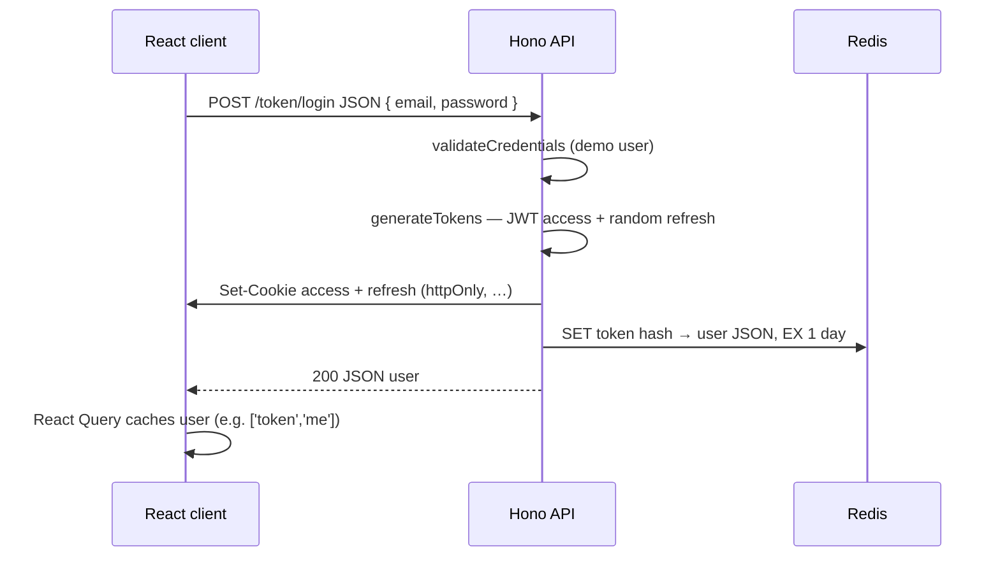
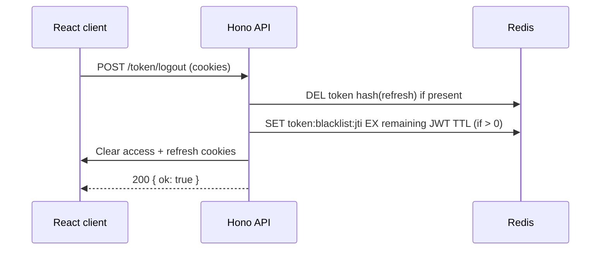

# Token authentication (access + refresh)

This project demonstrates **cookie-based token auth**: the browser never stores tokens in `localStorage` or application memory for API calls. Instead, the backend issues **HTTP-only cookies** that are sent automatically on each request when the client uses `credentials: 'include'`. That pattern leans on browser cookie rules rather than handing raw JWT strings to JavaScript.

---

## High-level overview

**What you are proving in code**

- After a successful login, the API returns **two artifacts**: a short-lived **access token** and a longer-lived **refresh token**.
- Both are placed in **cookies** (`httpOnly`, `SameSite`, and `Secure` in production) so script on your origin cannot read them easily, and the browser attaches them to same-site (or configured cross-origin) requests.
- **Access token**: a signed **JWT** (HS256) that encodes the user, an expiry, and a unique id (`jti`). It is used for routine authorized requests until it expires (here, about **15 minutes**).
- **Refresh token**: a **random** value (not a JWT) sent in a cookie. The server looks it up in **Redis** under a **deterministic hash** of that value (`Bun.hash`). It can mint new access (and refresh) tokens. It lasts **1 day** in both cookie `maxAge` and Redis **`EX`** TTL.

**How the pieces are split in this repo**


| Concern | Where it lives |
| -------- | ---------------- |
| Login credential check | `auth-api/src/routers/shared/middleware.ts` — `validateCredentials` (**demo** fixed email/password from `secretLogin` in `credentials.ts`) |
| Demo login user / schema | `auth-api/src/routers/shared/credentials.ts` |
| Access JWT signing / verification, cookie names & options | `auth-api/src/routers/tokens-router/tokens.ts` — `JWT_SECRET`, HS256, `auth-dojo-access-token`, `auth-dojo-refresh-token` |
| Refresh token → user mapping + access JWT blacklist | `auth-api/src/routers/tokens-router/store.ts` — **`store`**: Redis keys below, single shared client from `shared/redis.ts` |
| HTTP routes for `/token/*` | `auth-api/src/routers/tokens-router/index.ts` |
| `validateTokens` middleware | `auth-api/src/routers/tokens-router/middleware.ts` |
| CORS for credentialed browser calls | `auth-api/src/index.ts` — `credentials: true`, origin from `FRONTEND_URL` |


**Redis usage**

- **Refresh sessions:** key `token:<Bun.hash(refreshToken)>`, value JSON **`TokenUser`**, TTL **1 day** (`durationSeconds(1, 'days')`). The raw refresh token is only in the cookie; Redis stores a **hashed key** and user payload.
- **Access blacklist (logout / revoke):** key `token:blacklist:<jti>`, short value, TTL = remaining JWT lifetime (skipped if already expired).
- **`GET /health`:** checks the shared ioredis client is `ready`.

Redis is **required** for login, refresh rotation, logout blacklist behavior, and a healthy API process.

---

## How it works in general (conceptual)

1. **Access token** proves “who you are” for API requests. It expires quickly so a stolen token has a short window.
2. **Refresh token** proves “you are still allowed to get new access tokens” without typing the password again. The server stores an entry keyed by a **hash** of the refresh token so it can revoke rows, rotate tokens, and survive process restarts (Redis).
3. Putting tokens in **HTTP-only cookies** (with sensible `SameSite` / `Secure`) reduces the risk of theft via XSS compared to storing JWTs in JS-accessible storage — though you still need a strict Content Security Policy and careful coding, because XSS remains a serious threat elsewhere.

---

## Example flow: frontend → backend

The React app uses `fetch(..., { credentials: 'include' })` so cookies set by the API are sent on subsequent requests. The base URL comes from `VITE_API_URL` (see project `README`).

### 1. Login (`POST /token/login`)




**What happens to tokens**

- **Cookies**: The response **set-cookie** headers store the JWT and refresh value. The SPA does not need to read them.
- **Redis**: **`store.addUser`** writes **`token:<hash(refresh)>`** with **`JSON.stringify(user)`** and a **1 day** TTL. The refresh token string itself is not stored as the Redis key (only a stable hash).

### 2. Calling a protected route (`GET /token/me` or `/token/dashboard`)

```mermaid
sequenceDiagram
  participant FE as React client
  participant BE as Hono API
  participant R as Redis

  FE->>BE: GET /token/me (cookies attached)
  alt Access JWT valid and not blacklisted
    BE->>R: GET token:blacklist:jti
    R-->>BE: miss
    BE-->>FE: 200 user / data
  else Access JWT missing or invalid
    BE->>R: GET token hash(refresh) → user JSON
    alt Refresh valid
      BE->>BE: New access + refresh; rotate
      BE->>FE: Set-Cookie (new pair)
      BE->>R: DEL old token hash; SET new token hash EX 1d
      BE-->>FE: 200 user / data
    else Refresh missing / expired / unknown
      BE->>FE: Clear cookies; 401 Unauthorized
    end
  end
```


**Silent refresh behavior**

- Middleware **`validateTokens`** first tries the **access** cookie: verify signature, then **`store.isBlacklisted`** (`GET token:blacklist:jti`).
- If that path does not succeed, it uses the **refresh** cookie: **`store.getUser`**. If a row exists (key not expired), it issues a **new pair**, sets cookies, **`await store.removeUser(oldRefresh)`**, **`await store.addUser(newRefresh, user)`**, then continues.

So a user can keep working across the short access-token lifetime without re-logging in, as long as the refresh token is still valid in Redis.

### 3. Logout (`POST /token/logout`)




**Why Redis for blacklist**

- The access JWT might still be valid for a few minutes after logout. Blacklisting by **`jti`** under **`token:blacklist:<jti>`** with TTL equal to remaining JWT life **revokes** that JWT without waiting for natural expiry.

---

## Security properties this project exercises


| Property | What the project does |
| -------- | --------------------- |
| **Least exposure to XSS** | Tokens are **HTTP-only** cookies, not readable from `document.cookie` by app JS (malicious script could still perform requests as the user — CSP and input hygiene matter). |
| **Transport** | `secure: true` when `BUN_DEV === 'production'` so cookies are not sent over plain HTTP in prod. |
| **CSRF awareness** | `SameSite=Lax` reduces some cross-site request risks; it is not a complete CSRF story for every API shape. |
| **Short-lived access** | JWT expiry (~15 minutes) limits stolen access-token window. |
| **Refresh rotation** | On each refresh path, the **old** refresh token row is removed and the **new** one is stored — supports **detecting reuse** in a fuller design. |
| **Logout semantics** | Refresh row deleted; access token **blacklisted** in Redis until expiry. |
| **Stateful revocation** | Redis blacklist makes “logout now” meaningful for the current access JWT. |
| **Refresh at rest** | Redis keys use **`Bun.hash(refreshToken)`** so the cookie value is not stored verbatim as the key (still protect Redis like any secret store). |


---

## Realistic improvements (beyond this demo)

These are natural next steps when moving from a learning codebase to production:

1. **Richer session store** — Keep Redis for speed but add a **relational DB** for device lists, metadata, and admin “logout everywhere”; consider **HMAC-SHA256 (with a server pepper)** instead of `Bun.hash` if you need a documented, portable key scheme.
2. **Secrets management** — Use a stable, injected **`JWT_SECRET`** (and never rely on an ephemeral random default across process restarts, which would invalidate all tokens unpredictably).
3. **CSRF strategy** — For cookie-based auth, consider **double-submit cookies**, CSRF tokens for state-changing requests, or tightening **`SameSite`** where flows allow — especially if you add cross-site embedding or non-simple requests from other origins.
4. **Redis and availability** — **`/health`** already reflects Redis; in production you would plan **fallback** or **degraded** behavior if Redis is down (blacklist might be best-effort vs. total outage).
5. **Rate limiting & lockout** — Protect **`/token/login`** and refresh paths from brute force and token stuffing.
6. **Algorithm & key hygiene** — HS256 is fine with a strong secret; at larger scale, **asymmetric** keys (RS256/EdDSA) help when many services verify tokens. Rotate keys deliberately.
7. **Monitoring** — Alert on spike in 401s, Redis errors, or repeated refresh failures (possible token theft or misuse).
